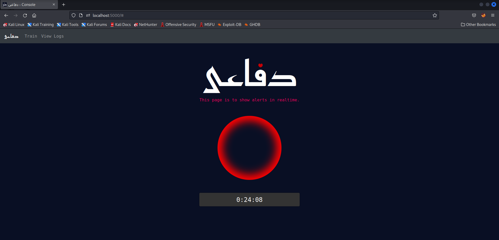
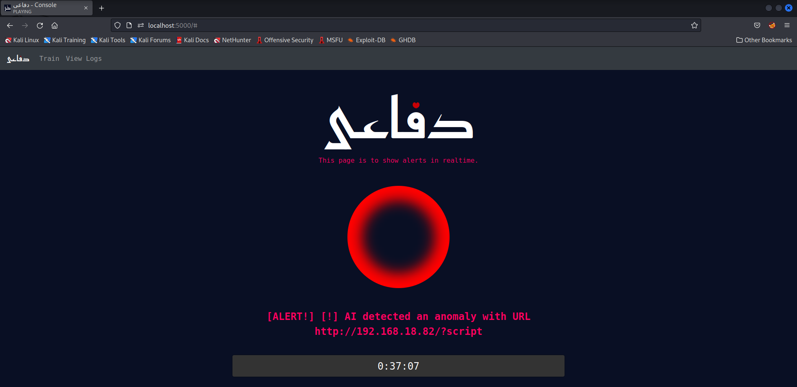
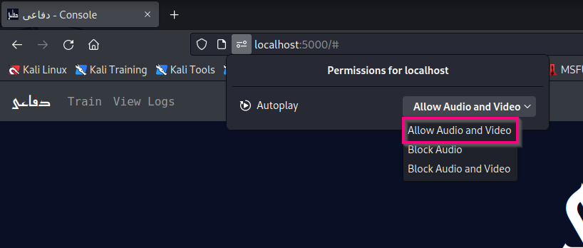
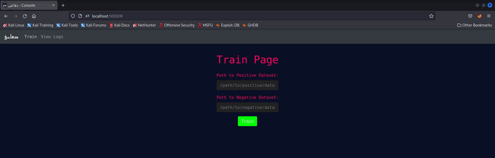
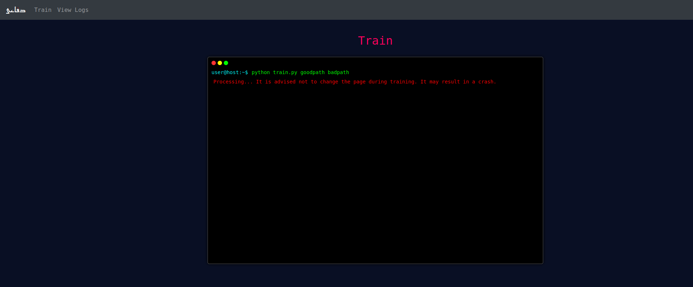
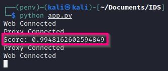
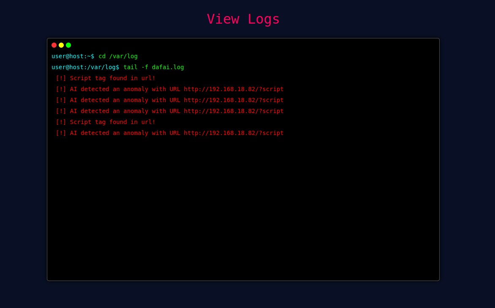

# دفاعی


An AI-supported web-application IDS (Intrusion Detection System) working at the application level to detect web-based attacks/anomalies.

## Jump To
- [Recognition](#recognition)
- [Scope](#scope)
    - [Target Users](#target-users)
    - [Risk Assesment](#risk-assessment)
    - [Security Requirements](#security-requirements)
    - [Effectiveness](#effectiveness)
- [Collection of Data](#collection-of-data)
- [Detection Methods](#detection-methods)
- [Testing the System](#test)
- [Deployment](#deployment)
    - [Web server configuration](#configuring-web-server-proxy-settings)
    - [Environment](#setting-up-environment)
- [Running the IDS](#running-the-ids)
    - [Web Application](#starting-the-web-application)
    - [MITMProxy](#starting-mitmproxy)
- [Documentation](#documentation)
    - [Technology Stack](#technology-stack)
    - [Folder Structure](#folder-structure)
    - [User Interface](#web-ui)
        - [Home](#home-page)
        - [Train](#train-page)
        - [View Logs](#view-logs-page)
    - [Machine Learning](#machine-learning)
    - [Adding Rules](#adding-rules)
- [Monitoring and Refining](#monitoring-and-refining)

## Recognition
This project is a team effort of the following members:
- [Abdullah Irfan](https://github.com/dingavinga1)
- [Muhammad Huzaifa](https://github.com/huzaifi0604)
- [Aisha Irfan](https://github.com/aishairfan)

## Scope

### Target Users
Organizations with web applications/servers that are critical for business flow. This application can help identify intrusions timely so that the organization faces a minimal loss.

### Risk Assessment
Web applications are bound to face attacks such as SQL Injection, XSS, Command Injection, etc. This application aims to detect any anomaly/signature related to web attacks. 

### Security Requirements
This application works alongside the fundamental layers of security i.e. it can detect traffic from a HTTPS server so that all communication between a web server and clients is encrypted while intrusion detection can still be performed on transparent web traffic. 

### Effectiveness
The effectiveness of this application depends upon the security team and the rules defined. Rules for almost any web attack can be defined in a JSON template but they need to be tuned according to an organizations needs. SOC analysts need to be alert so that they can work on the alerts triggered by the IDS.

## Collection of Data
This IDS works on data collected from any web server in realtime. It uses an open-source framework (MITMProxy) to intercept requests from a web server.

## Detection Methods
- Signature Based
- Anomaly Based

Rules can be defined for signature-based detection while anomaly-based detection is done with the help of an AI model. 

## Test
This system has been tested for string-matching and machine learning. The current AI model used provides an accuracy of 99% over the test data we provided. Alerts are triggered with a minimum delay i.e. < 1s.

## Deployment 
Setting this application up is simple and consists of the following steps components

### Configuring web server proxy settings
To receive HTTP and HTTPS web traffic, the web server needs to be configured to proxy requests to the IDS via port 8080. For an Apache web server, add the following lines to your website in the ```/etc/apache2/sites-enabled/000-default.conf``` or your custom configuration file:
``` apache
<VirtualHost *:443>
        ...
        ...
        ProxyPreserveHost On
        ProxyPass / http://localhost:8080/
        ProxyPassReverse / http://localhost:8080/
        ...
        ...
</VirtualHost>

```

Then, reload your Apache server: ```sudo service apache2 reload```

### Setting up environment
Although it can be run in the default python environment, we recommend the use of a virtual environment to keep dependencies separated. 
``` bash
python -m venv IDS
source IDS/bin/activate
pip install -r requirements.txt
```

Now that the initial configuration has been done, we can run the IDS.

## Running the IDS
To run the IDS, we will need two separate tabs i.e. for MITMProxy and the backend. (Please note that both tabs need to be in the previously created virtual environment)

### Starting the Web Application
To start the web application (IDS backend), we can use the following command: ```python app.py```. This will start a web server on ```http://localhost:5000```.

> Please note that the trained model is a little bulky in size so we decided not to upload it. We advise you to train the model against the mentioned dataset before running the application as an IDS.

### Starting MITMProxy 
Starting the web application is a dependency for this step as we are using Socket-IO for backend and frontend communication. That being said, the following command can be used to start up MITMProxy on port 8080: ```mitmproxy -s mitm.py```.

With this done, we can visit the console page for دفاعی on our web browser at ```http://locahost:5000/```.



## Documentation

### Technology Stack
#### Flask
Used at the backend for easy processing and integration of a web interface.
#### MITMProxy
Used to proxy requests from a web server to send to the IDS for processing.
#### Socket-IO
Used for backend and frontend communication. SocketIO is a lightweight web socket framework which can be used for realtime integration in web applications. Socket IO helps us transfer data between MITMProxy API and the backend and even the frontend. 
#### HTML, CSS, JQuery, Bootstrap
The frontend has been created in native HTML, CSS and Javascript. Bootstrap has been used to make the web console more responsive. JQuery has been utilized to integrate SocketIO into our frontend and to make the console a single-page web application. 


### Folder Structure
- **Dataset**: This folder contains the default datasets for training the AI Model:
    - goodqueries.txt
    - badqueries.txt

- **static**: This folder contains the static elements needed for the frontend i.e. alarm sound and logo. If you want to change the alarm sound, you can replace the ```beep.mp3``` file in this folder.

- **templates**: This folder contains the ```index.html``` file for the frontend. This does not need to be tampered unless you want to add custom styles, etc. 

- **alert.log**: This file is used to log all alerts generated by the IDS along with a UNIX timestamp for easy integration into a SIEM or IPS solution.

- **app.py**: This file contains the backend for the flask application.

- **mitm.py**: This file contains the API for sending requests captured by MITMProxy to the IDS.

- **model.joblib**: This file contains the default/custom-trained AI model for AI-based anomaly detection.

- **requirements.txt**: This file contains the dependencies needed to run this IDS.

- **rules.json**: This file contains any user-defined rules for the IDS. New objects can be added here.

- **train.py**: This file contains the code for training the AI model for anomaly-based detection. It can be modified for advanced changes in the way a model is trained i.e. if you want to use your own classification algorithm.

### Web UI
The web user-interface is designed to be simple to use and consists of the following components:

#### Home Page
This page remains static as can be seen above except for when an alert is recieved from the backend. When an alert is recieved:
- The circle will start glowing
- The alert will be displayed 
- A beep sound will be generated



The above will happens for 10 seconds or uptil a new alert is recieved. There is also a timer showing the time elapsed for the web console.

> Please note that to hear the sound, audio permissions need to be given to the website from the web browser.


#### Train Page
If a user wants to train the AI model on their custom dataset, this page allows them to do so. The user will be asked for the path to:
- Positive dataset 
- Negative dataset

on which the AI model will be trained.



When this form is submitted, the form will be replaced with a console-looking window showing the progress of the training.



> Please forgive us for an existing bug in our application which does not show when the dataset training is complete. We are working to fix that. Meanwhile, you can view the training accuracy as debug output in the flask server console.<br/> 



#### View Logs Page
This page is designed to keep track of all alerts received at the frontend in the current session, incase the analyst fails to notice an alert within the 10-second window. Here is an example of what this page would look like with logged alerts:



### Machine Learning
This IDS currently supports URL classification using machine learning. We use the **Term Frequency-Inverse Document Frequency Vectorization** technique for binary encoding of URLs and train the model on the **Logistic Regression** classification algorithm. 

### Adding Rules
To add rules, the ```rules.json``` file can be utilized. This file contains an array of alert objects which can be added for more rules. A template has been provided already which shows how to create a new object. An object can directly contain the following elements:
- url
- content
- headers
- alert

> Headers can further contain more elements which specify a rule for a specific header. The alert element specifies the alert you want to generate based on a rule.

This is an example of what the ```rules.json``` file would look like
```js
[
	{
		"url":"script",
		"alert":"[!] Script tag found in url!"
	},
	{
		"url":"UNION",
		"alert":"[!] UNION operator found in url!"
	},
	{
		"content":"<script>",
		"alert":"[!] Possible XSS Attack."
	},
	{
		"headers":{
			"Host":"localhost"
		},
		"alert":"Test HEADER"
	}
]
```

## Monitoring and Refining
For monitoring and refining this application, various techniques can be used. Logs have been integrated into the application which provide the malicious URL detected by machine learning. This helps to re-train the AI model based on newly found data, which can help tune the IDS better for your organization. We deployed this IDS for refining it and took care of the following:
- **Finding a suitable dataset**: We trained our model on 3 different datasets and chose the best suitable data for a web-application IDS.
- **Rooting out false positives**: We used 5 different binary encoding schemes for machine-learning, out of which the chosen one gives the least amount of false positives, due to a lower collision-rate. 
- **Adding header-based rules**: At first, we integrated rule creation based only on URL and content. However, after thorough research, we found out that a lot of web attacks can be done with the help of header manipulation, including cookies. Therefore, we added header-based rule creation so that each header can be matched with a rule for in depth intrusion detection.
